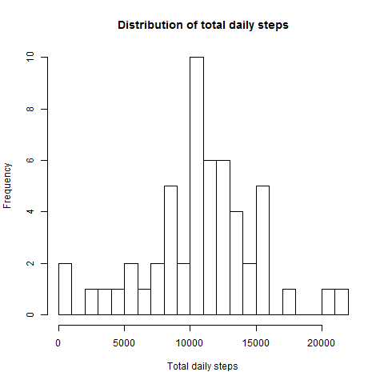
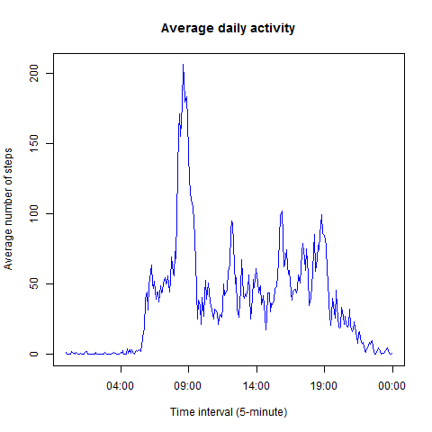
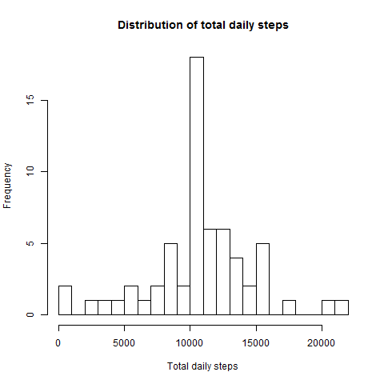

### Title: "Reproducible Research: Peer Assessment 1"
#### Author: "Sergey Kosenko"
#### date: `r date()`


### System information:
R version 3.2.0 (2015-04-16) -- "Full of Ingredients"</br>
Platform: i386-w64-mingw32/i386 (32-bit)</br>
OS: Windows 8

### Introduction
In this assignment we study how to make a reproducible research with using a tools of R programming language
and create R markdown papers and reports by method Literate Statistical Programming.	

### Source data
It is now possible to collect a large amount of data about personal movement using activity monitoring devices such as a Fitbit, Nike Fuelband, or Jawbone Up. These type of devices are part of the “quantified self” movement – a group of enthusiasts who take measurements about themselves regularly to improve their health, to find patterns in their behavior, or because they are tech geeks. But these data remain under-utilized both because the raw data are hard to obtain and there is a lack of statistical methods and software for processing and interpreting the data.

This assignment makes use of data from a personal activity monitoring device. This device collects data at 5 minute intervals through out the day. The data consists of two months of data from an anonymous individual collected during the months of October and November, 2012 and include the number of steps taken in 5 minute intervals each day.

The data (Dataset: Activity monitoring data [52K]) for this assignment downloaded from the course web site.
The variables included in this dataset are:
steps: Number of steps taking in a 5-minute interval (missing values are coded as NA)
date: The date on which the measurement was taken in YYYY-MM-DD format
interval: Identifier for the 5-minute interval in which measurement was taken
The dataset is stored in a comma-separated-value (CSV) file and there are a total of 17,568 observations in this dataset.

---
### Preparation phase

My native locale is not English. Changing locale and language to English:
```{r localization, results='hide'}
Sys.setlocale("LC_TIME", "eng")	# set the system locale
Sys.setenv(LANG = "en")			# set the English language
```

Code chunk for checking of existing the dataset and download if it not exist:
```{r downloading data, results='hide'}
if (!file.exists("./Dataset.zip") | !file.exists("activity.csv")) {
	print("Original files not found. Downloading data")
	fileUrl <- "http://d396qusza40orc.cloudfront.net/repdata%2Fdata%2Factivity.zip"
	download.file(fileUrl,destfile="./Dataset.zip",method="auto")
	unzip(zipfile="./Dataset.zip")
} else {
	print("Data set exists")
}
```

Include necessary libraries and setting options:
```{r librarys, results='hide', message=FALSE, warning=FALSE}
library(ggplot2) # for ggplot graph
library(lattice) # for lattice plot
options(scipen=1, digits=2) # number of decimals
```

### Analysis phase
After successful download we can start analysis:

     STEP 1: Loading and preprocessing the data
	 ASSIGNMENT:
     1.1 Show any code that is needed to load the data (i.e. read.csv())                       
     1.2 Process/transform the data (if necessary) into a format suitable for your analysis


```{r 1.1 load data 1.2 transform data}
# Decision:
# 1.1-1.2 Reading dataset from file and transform the data into a suitable format:
all_data <- read.csv("./activity.csv")
all_data$date <- as.Date(all_data$date, format="%Y-%m-%d")
```

    STEP 2: What is mean total number of steps taken per day?
	ASSIGNMENT: 
     For this part of the assignment, you can ignore the missing values in the dataset.   
     2.1 Calculate the total number of steps taken per day  
     2.2 If you do not understand the difference between a histogram and a barplot,
	 research the difference between them.    
     Make a histogram of the total number of steps taken each day     
     2.3 Calculate and report the mean and median of the total number of steps taken per day   
     
     
```{r 2.1 steps_date 2.2 histogram 2.3 mean_median, results='hide'}
# Decision:
# Excluding missing values from dataset:
	data_wna <- all_data[complete.cases(all_data),] 

#2.1 Calculating the total number of steps taken per day:
	steps_date <- aggregate(steps ~ date, data = data_wna, FUN = "sum")

#2.2 Making a histogram of the total number of steps taken each day:	
	# 2.2.1 Finding a count of breaks for histogram
	break1 <- round((max(steps_date$steps) - min(steps_date$steps))/1000, 0) + 2
	# 2.2.2 Make a histogram
	png("./figure/2.1 steps_date 2.2 histogram 2.3 mean_median-1.png")
	hist(steps_date$steps, breaks = break1, main = "Distribution of total daily steps",
	xlab = "Total daily steps", ylab = "Frequency")
	dev.off()
	
#2.3 Calculate and report the mean and median total number of steps taken per day
	mean_steps <- mean(steps_date$steps)		# [1] 10766.19
	median_steps <- median(steps_date$steps)	# [1] 10765
```


		
     Report:   
     Mean total number of steps taken per day: `r mean_steps`  
     Median total number of steps taken per day: `r median_steps` 
   
	 STEP 3: What is the average daily activity pattern? 
     ASSIGNMENT:    
     3.1 Make a time series plot (i.e. type = "l") of the 5-minute interval (x-axis) 
     and the average number of steps taken, averaged across all days (y-axis) 
     3.2 Which 5-minute interval, on average across all the days in the dataset,
	 contains the maximum number of steps? 
     
     Decision:
     3.1 Make a time series plot
     Primarily we must prepare time series data.
     "interval" data (type: integer) in the end of hour and start of the next hour have data: ... 55 100 ...
     If we plot a graph with this data as integer numbers then between points 55 and 100 will be a gap,
     In line plot this gap is filled a straight line from (55 to 100). For time intervals that do not exist,
     because real time data goes only from 0 to 60 every hour.
     Therefore we must convert integer interval data into time interval data with next code:
```{r 3.1 time series plot, results='hide'}
	# 3.1.1 Getting average numbers of steps by 5-minute intervals across all days	
	steps_mean5 <- aggregate(steps ~ interval, data = all_data, FUN = "mean")
	# 3.1.2 Setup "4 digits length" format for interval data
	steps_mean5$interval <- sprintf("%04d", steps_mean5$interval)
	# 3.1.3 Convert "4 digits data" to datetime data 
	steps_mean5$interval <- strptime(steps_mean5$interval, format="%H%M")
	# Make a plot:
	png("./figure/3.1 time series plot-1.png")
	plot(steps_mean5$interval, steps_mean5$steps, type = "l", col = "blue", 
	main = "Average daily activity", xlab = "Time interval (5-minute)", ylab = "Average number of steps")
	dev.off()
```


```{r 3.2 maximum steps, results='hide'}
     # 3.2 Which 5-minute interval, on average across all the days in the dataset, 
     # contains the maximum number of steps?
     steps_mean5$interval <- strftime(steps_mean5$interval, format="%H:%M")
     steps_mean5[which.max(steps_mean5$steps),][[1]]
```
     Report: `r steps_mean5[which.max(steps_mean5$steps),][[1]]` is interval with maximum number of steps across all the days in the dataset.	

	 STEP 4: Imputing missing values
     ASSIGNMENT:    
     Note that there are a number of days/intervals where there are missing values (coded as NA).   
     The presence of missing days may introduce bias into some calculations or summaries of the data.    
     4.1 Calculate and report the total number of missing values in the dataset
	 (i.e. the total number of rows with NAs)     
     4.2 Devise a strategy for filling in all of the missing values in the dataset. 
     The strategy does not need to be sophisticated. For example, you could use the mean/median for that day, 
     or the mean for that 5-minute interval, etc. 
	 4.3 Create a new dataset that is equal to the original dataset but with the missing data filled in. 
	 4.4 Make a histogram of the total number of steps taken each day 
     4.5 Calculate and report the mean and median total number of steps taken per day. 
     Do these values differ from the estimates from the first part of the assignment? 
     What is the impact of imputing missing data on the estimates of the total daily number of steps?    
     
```{r 4.1 missing values}
     # Decision:
     # 4.1 Calculate and report the total number of missing values in the dataset
     # (i.e. the total number of rows with NAs)
     na_count <- sum(!complete.cases(all_data)) # Count of incomplete cases
```     
     REPORT: `r na_count` is total number of rows with NAs.

```{r 4.2 strategy 4.3 fill_data}
    # 4.2 Devise a strategy for filling in all of the missing values in the dataset. 
	# My strategy: 
	# 1. Calculate a mean value for 5-minute intervals across all the days in the dataset
	# 2. Fields with NA will be filled a mean data from corresponding 5-minute interval
     
     # 4.3 Create a new dataset that is equal to the original dataset but with the missing data filled in.		
	steps_mean5 <- aggregate(steps ~ interval, data = all_data, FUN = "mean")
	# creating new dataset and filling values NA to mean data
     fill_data <- all_data 
	for(i in 1:nrow(fill_data)) { 
		if (is.na(fill_data$steps[i])) {
			fill_data[i,][1] <- steps_mean5[ steps_mean5$interval == fill_data[i,3], ][2]
		}
	}	
```

```{r 4.4 histogram 4.5 mean median, results='hide'} 
     # 4.4 Make a histogram of the total number of steps taken each day and
	# 4.4.1 Calculating the total number of steps taken per day:
     steps_date2 <- aggregate(steps ~ date, data = fill_data, FUN = "sum")
	# 4.4.2 Finding a count of breaks for histogram
     break2 <- round((max(steps_date2$steps) - min(steps_date2$steps))/1000, 0) + 2
	# 4.4.3 Make a histogram
     png("./figure/4.4 histogram 4.5 mean median-1.png")
	 hist(steps_date2$steps, breaks = break2, main = "Distribution of total daily steps", 
     xlab = "Total daily steps", ylab = "Frequency")
	 dev.off()
	# 4.5 Calculate and report the mean and median total number of steps taken per day.
	mean_steps2 <- mean(steps_date2$steps)		# [1] 10766.19
	median_steps2 <- median(steps_date2$steps)	# [1] 10766.19
	# create a table with mean and median data for convenient analysis:
	total <- matrix(c(mean_steps, median_steps, mean_steps2, median_steps2), nrow = 2, ncol = 2, byrow = TRUE, 
	dimnames = list(c("Ignoring NA", "Imputing NA"), c("Mean", "Median")))
	total
```

	
	 REPORT: Imputing NA to mean value in new dataset don't changed mean value in new dataset
	 and practically don't affected on median value in new dataset.
    
	 STEP 5: Are there differences in activity patterns between weekdays and weekends?
     ASSIGNMENT:    
     For this part the weekdays() function may be of some help here. 
     Use the dataset with the filled-in missing values for this part.
     5.1  Create a new factor variable in the dataset with two levels – “weekday” and “weekend” indicating 
     whether a given date is a weekday or weekend day.
     5.2 Make a panel plot containing a time series plot (i.e. type = "l") of the 5-minute interval (x-axis) 
     and the average number of steps taken, averaged across all weekday days or weekend days (y-axis). 
     See the README file in the GitHub repository to see an example of what
	 this plot should look like using simulated data. 
     
```{r 5.1 factor variables 5.2 panel plot, results='hide'}
	# Decision:
     #5.1  Create a new factor variable in the dataset with two levels – “weekday” and “weekend” indicating 
     # whether a given date is a weekday or weekend day.
	fill_data$dayweek <- as.factor(ifelse(weekdays(fill_data$date) %in% c("Saturday","Sunday"),"weekend", "weekday"))
     # 5.2 Make a panel plot containing a time series plot (i.e. type = "l") of the 5-minute interval (x-axis)
     # and the average number of steps taken, averaged across all weekday days or weekend days (y-axis).
	steps_date3 <- aggregate(steps ~ dayweek + interval, data = fill_data, FUN = "mean")
	png("./figure/5.1 factor variables 5.2 panel plot-1.png")
	panelplot <- xyplot(steps ~ interval | dayweek, data = steps_date3, layout = c(1, 2), type = "l",
	xlab = "Interval", ylab = "Number of steps") ## Plot with 2 panels
	print(panelplot)
	dev.off()
```

	
	Assignment finished.